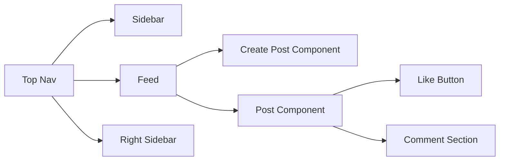

## 1. General Requirements

### Functional Requirements

- **News Feed Display**: Displays user posts in reverse chronological order, showing the latest posts first.
- **Create Post (Text/Image/Video)**: Allows users to create a new post by entering text and optionally attaching images or videos.
- **Like, Comment, Share functionality**: Enables user engagement with the posts through liking, commenting, or sharing them.
- **User Avatar in the posts**: Displays the author’s avatar in each post to help users visually identify the post creator.
- **Search Bar (Users/Posts/Hashtags)**: A universal search component that lets users look up other users, specific posts, or trending hashtags.
- **Responsive UI**: Ensures that the interface adapts seamlessly across different screen sizes and devices, including desktops, tablets, and smartphones.
- **Scroll through previous posts**: Allows users to keep browsing older posts by scrolling, typically paired with infinite scroll. (Posts in reverse chronological order)

### Non-Functional Requirements

- **High performance and low latency**: The app should deliver a fast experience with minimal delays in user interaction and feed loading.
- **Offline support**: Enables users to view cached posts and interact (like/comment) even when offline, syncing changes when reconnected.
- **Accessibility support**: Follows WCAG guidelines to ensure inclusivity for users with disabilities, including screen reader support and keyboard navigation.
- **SEO-Friendly**: Optimizes content and metadata for better visibility in search engines, especially for public profile or post pages.
- **Secure**: Uses HTTPS, sanitizes inputs, and ensures secure storage of user tokens and sensitive data.
- **Fast load times**: Targets loading the first feed within 1 second, using optimizations like async scripts, lazy loading, and minimized bundle size.
- **Infinite Scroll in News Feed**: Dynamically loads posts as the user scrolls, reducing initial load time and improving user engagement. and low latency


---

## 2. Mockup

### HTML & CSS Wireframe:

```html
<!DOCTYPE html>
<html lang="en">
<head>
  <meta charset="UTF-8" />
  <meta name="viewport" content="width=device-width, initial-scale=1.0"/>
  <title>Social Feed - [ ] Wireframe</title>

  <style>
    * {
      box-sizing: border-box;
      margin: 0;
      padding: 0;
    }

    body {
      font-family: 'Comic Sans MS', cursive;
      background: white
    }

    .container {
      display: flex;
      flex-direction: column;
      height: 100vh;
    }

    .header {
      padding: 10px;
      border: 2px solid black;
    }

    .header h1 {
      font-size: 24px;
    }

    .main {
      flex: 1;
      display: flex;
    }

    .navigation,
    .suggestions {
      flex: 1;
      padding: 10px;
      border: 1px solid black;
      text-align: center;
    }

    .feed {
      flex: 2;
      padding: 10px;
      border: 1px solid black;
      display: flex;
      flex-direction: column;
      gap: 20px;
    }

    .post-card {
      display: flex;
      border: 2px solid black;
      padding: 10px;
    }

    .avatar {
      width: 60px;
      height: 60px;
      border: 2px solid black;
      border-radius: 50%;
      text-align: center;
      line-height: 60px;
      margin-right: 10px;
      font-size: 12px;
    }

    .post-body {
      flex: 1;
      display: flex;
      flex-direction: column;
      justify-content: space-between;
    }

    .input-box,
    .content {
      border: 2px solid black;
      padding: 10px;
      margin-bottom: 10px;
      height: 60px;
    }

    .file-upload {
      margin-bottom: 10px;
    }

    .file-upload label {
      border: 2px solid black;
      padding: 5px 10px;
      cursor: pointer;
      display: inline-block;
    }

    .file-upload input[type="file"] {
      display: none;
    }

    .actions {
      display: flex;
      gap: 10px;
    }

    .actions button {
      border: 2px solid black;
      background: white;
      padding: 5px 10px;
      cursor: pointer;
    }
  </style>
</head>
<body>
  <div class="container">
    <header class="header">
      <h1>Social Feed</h1>
    </header>

    <div class="main">
      <aside class="navigation">
        <p>Navigation</p>
      </aside>

      <section class="feed">
        <!-- Post Input -->
        <div class="post-card">
          <div class="avatar">Avatar</div>
          <div class="post-body">
            <div class="input-box">input field</div>
            <div class="file-upload">
              <label for="mediaUpload">Upload Media</label>
              <input type="file" id="mediaUpload" name="media" accept="image/*,video/*" multiple>
            </div>
            <div class="actions">
              <button>Like</button>
              <button>Comment</button>
            </div>
          </div>
        </div>

        <!-- Post 1 -->
        <div class="post-card">
          <div class="avatar">Avatar</div>
          <div class="post-body">
            <div class="content">post content</div>
            <div class="actions">
              <button>Like</button>
              <button>Comment</button>
              <button>Share</button>
            </div>
          </div>
        </div>

        <!-- Post 2 -->
        <div class="post-card">
          <div class="avatar">Avatar</div>
          <div class="post-body">
            <div class="content">post content</div>
            <div class="actions">
              <button>Like</button>
              <button>Comment</button>
              <button>Share</button>
            </div>
          </div>
        </div>
      </section>

      <aside class="suggestions">
        <p>Suggestion</p>
      </aside>
    </div>
  </div>
</body>
</html>

```


---

## 3.  Description of Diagram




---

## 4. Low Level Design - Data Models (TypeScript)

```ts
type User = {
  id: string;                 // Unique identifier for the user
  name: string;               // Display name of the user
  avatarUrl?: string;         // Optional avatar image URL
};

type Media = {
  id: string;                 // Unique identifier for the media file
  type: 'image' | 'video';    // Type of media
  url: string;                // Public URL of the media file
};

type Comment = {
  id: string;                 // Unique identifier for the comment
  postId: string;             // Associated post ID
  author: User;               // User who wrote the comment
  content: string;            // Text of the comment
  media?: Media[];            // Optional media files (images/videos)
  createdAt: string;          // ISO timestamp
};

type Post = {
  id: string;                 // Unique identifier for the post
  author: User;               // Post creator
  content: string;            // Main text content
  media?: Media[];            // Optional media (images/videos)
  createdAt: string;          // ISO timestamp
  likes: number;              // Total number of likes
  comments: Comment[];        // List of comments
};
```

These models serve as the foundation for UI rendering and backend communication. `User` represents people, `Post` holds feed content, `Media` supports file attachments, and `Comment` enables conversation.


---

## 7. API Design

```ts
// GET /api/feed
function fetchFeed(): Promise<Post[]> {}
```

- **Purpose**: Fetches a list of all posts to be shown in the user's news feed.
- **Used By**: Feed component on initial load and infinite scroll trigger.

```ts
// POST /api/post
function createPost(post: Omit<Post, 'id' | 'createdAt' | 'likes' | 'comments'>): Promise<Post> {}
```

- **Purpose**: Creates a new post (with text and/or media) and returns the saved post object.
- **Used By**: CreatePost component.
- **Note**: Media files can be included via a multipart/form-data API.

```ts
// POST /api/like
function likePost(postId: string): Promise<void> {}
```

- **Purpose**: Likes the specified post and updates the like count.
- **Used By**: Like button in each Post component.

```ts
// POST /api/comment
function commentOnPost(postId: string, comment: Omit<Comment, 'id' | 'createdAt'>): Promise<Comment> {}
```

- **Purpose**: Adds a comment (optionally with media) to the specified post.
- **Used By**: Comment input area in each Post component.

```ts
// POST /api/share
function sharePost(postId: string): Promise<void> {}
```

- **Purpose**: Shares the post to the user's profile or followers’ feed.
- **Used By**: Share button in each Post component.

```ts
// GET /api/user/:id
function fetchUser(id: string): Promise<User> {}
```

- **Purpose**: Fetches a user by ID, useful for displaying user info, avatars, and profiles.
- **Used By**: Post, Comment, Header/Userbar components.

### UI Component Usage

- **Feed Component**: Calls `fetchFeed`
- **CreatePost Component**: Calls `createPost`
- **Post Component**: Calls `likePost`, `commentOnPost`


---

## 8. Networking

### Definitions of Realtime Communication Techniques

- **Polling**: The client repeatedly sends HTTP requests at fixed intervals to check for updates from the server. Simple to implement but inefficient due to redundant requests.

```tsx
useEffect(() => {
  const interval = setInterval(() => {
    fetch('/api/feed')
      .then(res => res.json())
      .then(data => setPosts(data));
  }, 5000);
  return () => clearInterval(interval);
}, []);
```

- **Long Polling**: The client sends a request, and the server holds the response until data is available or a timeout occurs. More efficient than polling, mimicking real-time behavior.

```js
function longPoll() {
  fetch('/api/feed/long-poll')
    .then(res => res.json())
    .then(data => {
      updateUI(data);
      longPoll();
    })
    .catch(err => {
      setTimeout(longPoll, 2000);
    });
}
longPoll();
```

- **Server-Sent Events (SSE)**: A one-way channel from the server to the client using a single long-lived HTTP connection. Ideal for news feeds where updates flow only from server to client.

```tsx
useEffect(() => {
  const eventSource = new EventSource('/api/feed/stream');
  eventSource.onmessage = (event) => {
    const newPost = JSON.parse(event.data);
    setPosts(prev => [newPost, ...prev]);
  };
  eventSource.onerror = () => eventSource.close();
  return () => eventSource.close();
}, []);
```

- **WebSockets**: A full-duplex communication protocol enabling real-time interaction both ways using a persistent connection. Suitable for chat apps or live collaboration.

```tsx
useEffect(() => {
  const socket = new WebSocket('wss://example.com/feed');
  socket.onmessage = (event) => {
    const newPost = JSON.parse(event.data);
    setPosts(prev => [newPost, ...prev]);
  };
  socket.onerror = (e) => console.error('WebSocket error:', e);
  return () => socket.close();
}, []);
```


### Comparison Table

| Feature         | Polling     | Long Polling | SSE         | WebSockets  |
|----------------|-------------|--------------|-------------|-------------|
| Push           | ❌ No       | ✅ Yes       | ✅ Yes      | ✅ Yes      |
| Complexity     | 🟢 Low      | 🟡 Medium    | 🟡 Medium   | 🔴 High     |
| Browser Support| ✅ High     | ✅ High      | ⚠️ Medium  | ✅ High     |
| Bi-directional | ❌ No       | ❌ No        | ❌ No       | ✅ Yes      |
| Latency        | 🔴 High     | 🟡 Medium    | 🟢 Low      | 🟢 Low      |

<br>

### Best for News Feed: **SSE** (Simple, efficient, one-way updates)

**Why SSE is ideal for a News Feed UI:**

- **Unidirectional Nature Fits the Use Case**: News feeds require data to flow only from the server to the client. Users aren’t pushing updates constantly; they mostly read.
- **Low Latency Push from Server**: SSE allows the server to push new posts as soon as they are published with minimal delay and without polling overhead.
- **Reduced Bandwidth Usage**: Unlike polling or WebSocket keep-alive messages, SSE keeps the HTTP connection open and sends only meaningful data.
- **Built-in Reconnection and Retry**: Modern browsers automatically try to reconnect if the SSE connection drops, simplifying resilience.
- **Browser Support is Sufficient**: SSE works well across all major modern browsers. For older browsers, fallbacks like long polling can be used.
- **Ease of Implementation**: Compared to WebSockets, SSE is easier to implement on both server and client, using plain HTTP without a complex handshake.

Together, these characteristics make SSE an excellent default choice for a real-time feed delivery system with low engineering overhead and good UX.

### Fallback Strategies for Realtime Mechanisms

When WebSockets or SSE are unavailable (due to firewall, proxy issues, or older browsers), fallback mechanisms can be used:

- **Automatic Fallback to Long Polling**: If SSE/WebSocket connection fails, switch to long polling using HTTP.
- **Retry with Exponential Backoff**: Retry connection attempts with increasing delays.
- **Heartbeat & Timeout Detection**: Use client-side pings to detect dropped connections.
- **Graceful Degradation**: Continue allowing read-only access to existing posts and user actions using REST APIs if real-time is not available.

### REST vs GraphQL

| Feature       | REST     | GraphQL      |
| ------------- | -------- | ------------ |
| Over-fetching | Yes      | No           |
| Versioning    | Required | Not Required |
| Caching       | Easy     | Complex      |

### HTTP/1.1 vs HTTP/2

| Feature            | HTTP/1.1 | HTTP/2 |
| ------------------ | -------- | ------ |
| Multiplexing       | No       | Yes    |
| Header Compression | No       | Yes    |
| Push Support       | No       | Yes    |

Best for feed: **HTTP/2 + SSE or WebSocket**


---

## 9. Performance Optimization

## a. Infinite Scroll in a News Feed System

**Infinite Scroll** is a UI/UX pattern where new content is loaded as the user scrolls down, eliminating the need for traditional pagination. It creates a continuous browsing experience often used in social media feeds and news apps.

### Advantages in a News Feed System

| Advantage                 | Description                                                                 |
|--------------------------|-----------------------------------------------------------------------------|
| **Smooth UX**            | Seamless content loading improves user experience.                          |
| **Higher Engagement**    | Users are likely to stay longer as content keeps appearing automatically.   |
| **Faster Initial Load**  | Only initial content loads first; more loads only when needed.              |
| **Mobile Optimized**     | Better experience for touch interfaces — no small buttons to click.         |
| **Reduced Navigation**   | No need for pagination or "Next" buttons.                                   |

### JavaScript Implementation (Vanilla JS)

```js
async function fetchPosts(pageNumber) {
  // Simulate API delay
  return new Promise((resolve) => {
    setTimeout(() => {
      const posts = Array.from({ length: 10 }, (_, i) => ({
        id: `post-${(pageNumber - 1) * 10 + i + 1}`,
        content: `This is post #${(pageNumber - 1) * 10 + i + 1}`,
      }));
      resolve(posts);
    }, 1000);
  });
}

async function loadMorePosts() {
  if (isLoading) return;
  isLoading = true;
  loader.style.display = 'block';

  const posts = await fetchPosts(page);
  posts.forEach(post => {
    const div = document.createElement('div');
    div.className = 'post';
    div.textContent = post.content;
    feed.appendChild(div);
  });

  page += 1;
  isLoading = false;
  loader.style.display = 'none';
}

const observer = new IntersectionObserver(entries => {
  if (entries[0].isIntersecting) {
    loadMorePosts();
  }
});

observer.observe(loader);

// Initial load
loadMorePosts();
```


## b. React Optimization: React.lazy, Suspense, and react-window

This document explains how to optimize a React-based Infinite Scroll News Feed using:

- React.lazy
- Suspense
- react-window (for virtualization)

## React.lazy

### Purpose

React.lazy is used for code-splitting. It allows you to load a component only when it is needed. This is useful for large components such as post details, media viewers, or modals that are not needed on initial page load.

### Benefits

- Reduces initial JavaScript bundle size
- Improves Time to Interactive
- Helps avoid rendering unused code up-front

### Example

```jsx
import React, { useState, Suspense } from 'react';

const PostDetails = React.lazy(() => import('./PostDetails'));

function NewsFeed() {
  const [selectedPost, setSelectedPost] = useState(null);

  return (
    <div>
      <div onClick={() => setSelectedPost(123)}>Click to View Details</div>

      <Suspense fallback={<div>Loading details...</div>}>
        {selectedPost && <PostDetails postId={selectedPost} />}
      </Suspense>
    </div>
  );
}
```

## Suspense

### Purpose

Suspense is used to wrap a lazy-loaded component and show fallback UI (e.g. a spinner or placeholder) while the component is being loaded.

### Benefits

- Provides user feedback while loading
- Works seamlessly with React.lazy
- Simplifies async UI states

### Example

```jsx
<Suspense fallback={<div>Loading...</div>}>
  <LazyComponent />
</Suspense>
```

## react-window

### Purpose

react-window provides virtualized list rendering — it only renders the items currently visible in the viewport. This is useful for news feeds with a large number of posts.

### Benefits

- Reduces number of DOM nodes
- Improves scrolling performance
- Handles thousands of items efficiently

### Installation

```bash
npm install react-window
```

### Example

```jsx
import { FixedSizeList as List } from 'react-window';

const PostRow = ({ index, style, data }) => {
  const post = data[index];
  return (
    <div style={style} className="p-4 border-b">
      {post.content}
    </div>
  );
};

function VirtualizedFeed({ posts }) {
  return (
    <List
      height={600}
      itemCount={posts.length}
      itemSize={100}
      width={'100%'}
      itemData={posts}
    >
      {PostRow}
    </List>
  );
}
```


## Best Practices Summary

| Tool           | Use Case                        | Works With         |
|----------------|----------------------------------|--------------------|
| React.lazy     | Code-splitting large components  | Suspense           |
| Suspense       | UI fallback for lazy loading     | React.lazy         |
| react-window   | Virtualize large post lists      | IntersectionObserver, InfiniteLoader |


## Recommendation

Use React.lazy to defer heavy UI components. Wrap them in Suspense to handle loading states gracefully. For rendering long lists efficiently, integrate react-window to virtualize your News Feed and improve scroll performance.


## c. Debounce vs Throttle in News Feed System


### Debounce

**Debounce** is a technique to delay the execution of a function until after a specified wait time has passed **since the last time it was invoked**.

### Behavior:
- Only executes the function **once**, after a period of inactivity.
- Useful when you want to limit the rate of invocation based on **user stopping actions**.

### Example Use Case in News Feed:
- **Search bar typing**: When a user types in a search input to look for a post, you only want to send the API request **after they stop typing** for a short period (e.g., 300ms).


### Throttle

**Throttle** limits the execution of a function to **once every X milliseconds**, **regardless of how many times the event is triggered**.

### Behavior:
- Ensures the function runs at **regular intervals**, no more often than the specified time limit.
- Useful for limiting calls **during continuous events**.

### Example Use Case in News Feed:
- **Scroll event listener**: As the user scrolls through the feed, you can use throttle to check their scroll position and load more posts **at most once every 200ms**, avoiding performance issues.


## Difference Between Debounce and Throttle

| Feature           | Debounce                                | Throttle                                   |
|------------------|------------------------------------------|--------------------------------------------|
| Execution Timing | After the event has stopped              | At regular intervals while event is firing |
| Use Case         | Wait for "quiet" period                  | Limit rate of function execution           |
| Common Usage     | Auto-suggest, live search, input typing  | Scroll, resize, mouse move                 |
| Call Frequency   | Called once after burst ends             | Called periodically during burst           |


## Where to Use in a News Feed System

| Scenario                      | Recommended Approach | Reason                                                                 |
|------------------------------|----------------------|------------------------------------------------------------------------|
| User typing in search box    | Debounce             | Avoid sending too many API calls while user is still typing            |
| Infinite scroll position     | Throttle             | Check scroll position periodically instead of every pixel movement     |
| Window resize                | Throttle             | Prevent layout calculations firing on every small resize movement      |
| Filtering or tag input       | Debounce             | Trigger filtering after user finishes typing                          |


## Example: Debounce Function

```js
function debounce(fn, delay) {
  let timer;
  return function (...args) {
    clearTimeout(timer);
    timer = setTimeout(() => fn.apply(this, args), delay);
  };
}
```

## Example: Throttle Function

```js
function throttle(fn, limit) {
  let lastCall = 0;
  return function (...args) {
    const now = Date.now();
    if (now - lastCall >= limit) {
      lastCall = now;
      fn.apply(this, args);
    }
  };
}
```


## Summary

- Use **debounce** to delay actions until the user is done interacting.
- Use **throttle** to limit how often something is allowed to run in response to high-frequency events.
- Both techniques are critical in building a **high-performance, smooth** News Feed system.


# d. Content Delivery Network (CDN)

## What is a CDN?

A **Content Delivery Network (CDN)** is a geographically distributed network of servers that delivers static content (like images, CSS, JavaScript, videos, fonts, etc.) to users based on their location.

Rather than serving assets from the origin server every time, a CDN caches and serves them from **edge locations** that are physically closer to the user, reducing latency and load times.


## Benefits of CDN in a News Feed System

In a News Feed System (e.g., social media, blog platforms, news apps), the CDN plays a critical role in performance and scalability.


---

### 1. Faster Asset Delivery

CDNs reduce latency by serving static assets (post images, profile pictures, videos) from the nearest edge server to the user.

**Example**: A user in Mumbai viewing a news feed hosted in New York will receive images from a CDN node in India instead of the U.S.


---

### 2. Reduced Load on Origin Server

By offloading static content to the CDN, the main application server can focus on serving dynamic content (e.g., latest posts, user interactions).

**Result**: Lower server costs and better performance under high traffic.


---

### 3. Scalability

CDNs can handle large surges in traffic without affecting the origin infrastructure, making them ideal for viral posts or breaking news.

**Example**: A trending post generating millions of views in minutes won’t overwhelm the backend — the static content is cached and distributed.


---

### 4. Improved User Experience

Faster load times lead to lower bounce rates and higher engagement. Posts with images/videos render quicker, improving the scrolling experience.


---

### 5. Cache Invalidation and Versioning

CDNs support cache control and versioning, which allows for smart caching strategies — you can force updates for specific assets without clearing the whole cache.

**Example**: Updating a profile picture or a branded banner in the feed without breaking user sessions.


## Summary Table

| Benefit                | Description                                                              |
|------------------------|---------------------------------------------------------------------------|
| Fast Load Times        | Serves static assets from closest geographic location                    |
| Origin Server Relief   | Reduces backend load by caching frequently requested resources            |
| Global Reach           | Seamless experience for users across regions                              |
| High Availability      | CDNs offer redundancy and uptime even if the origin server goes down      |
| Scalable Infrastructure| Handles large volumes of traffic without additional backend infrastructure|


## Common Assets Served via CDN in News Feed

- Post images, cover images, profile photos
- Thumbnails and embedded media
- CSS and JavaScript bundles
- Fonts and icons
- Pre-rendered HTML fragments (in some architectures)

# e. Server Side Rendering (SSR)


## What is Server Side Rendering?

**Server Side Rendering (SSR)** is the process where a web page is rendered on the server at request time — the server generates the full HTML for a page and sends it to the client (browser).

Instead of sending a mostly empty HTML shell and letting JavaScript render the page (as in CSR — Client Side Rendering), SSR sends a **fully-rendered HTML document**, improving initial load and SEO.


## How SSR Works

1. A user requests a URL (e.g., `/feed`).
2. The server fetches the data (e.g., latest posts).
3. The server renders the page (e.g., HTML for feed list).
4. The fully-rendered HTML is sent to the client.
5. JavaScript then hydrates the app for interactivity.


## Benefits of SSR in a News Feed System


---

### 1. Faster First Contentful Paint (FCP)

SSR delivers complete HTML immediately, allowing browsers to show meaningful content faster — especially useful for first-time visitors.

**Impact**: Users see feed items (text, images) before JS is downloaded/executed.


---

### 2. Better SEO

Search engines can crawl SSR-rendered pages more effectively than CSR apps, making feed pages (e.g., public profiles, post pages) more discoverable.

**Impact**: Improves organic visibility for shared news posts, tags, and user profiles.


---

### 3. Improved Performance on Slow Devices

Older or low-end devices benefit because rendering is done on the server. The browser has less JavaScript work to do on page load.

**Impact**: Better UX for users on mobile or slow connections.


---

### 4. Sharable, Pre-rendered Content

Pages like `/post/:id`, `/profile/:id`, or `/tag/:tagName` can be served with meaningful HTML when shared on social media or accessed directly.

**Impact**: Enhanced previews, link sharing, and engagement.


---

### 5. Predictable Page Output

SSR allows better monitoring of page rendering since content is generated centrally on the server.

**Impact**: Easier debugging, consistent layout across clients.


## When to Use SSR in News Feed

| Page Type                   | SSR Recommended | Reason                                             |
|----------------------------|-----------------|----------------------------------------------------|
| Home feed (auth required)  | ❌ No            | Content is personalized; CSR or hybrid preferred   |
| Public post detail page    | ✅ Yes           | Sharable, needs SEO, quick first load              |
| Profile pages              | ✅ Yes           | Often public, shareable, SEO-friendly              |
| Tag or trending feed       | ✅ Yes           | Queryable, linkable, crawlable                     |
| Notifications / Chat       | ❌ No            | Real-time data, better handled client-side         |


## Trade-offs

| Pros                          | Cons                                 |
|------------------------------|--------------------------------------|
| Fast initial load            | Higher server cost and complexity    |
| SEO-friendly                 | Slower interaction until hydration   |
| Better for static or public  | Not ideal for highly dynamic UIs     |


## Summary

Server Side Rendering (SSR) brings significant benefits to a News Feed System where **SEO**, **initial performance**, and **shareability** matter — especially for public or static-like content (e.g., post details, profile pages). For highly personalized or real-time sections, a hybrid or CSR approach is often better.


# f. SHARP API with CDN

## What is SHARP?

**SHARP** is a high-performance Node.js image processing library used to manipulate and optimize images on the server. It supports:

- Resizing
- Cropping
- Format conversion (JPEG, PNG, WebP, AVIF)
- Compression and quality control
- Rotation, blur, and more filters

SHARP is widely used in backend systems for **real-time image transformation** and **preprocessing** before delivery to the client.


## Why Use SHARP in a News Feed System?

News Feeds are media-heavy (profile pictures, post images, banners, videos). Serving high-resolution images directly:

- Slows down page load
- Consumes excessive bandwidth
- Affects performance on mobile devices

Using SHARP allows you to:

- Resize images on the fly (e.g., thumbnail for feed, full-size for detail view)
- Convert large images to efficient formats like WebP or AVIF
- Optimize for screen size, connection speed, and device type


## How SHARP Works with CDN

SHARP can be integrated into your **image service layer**, and then the processed images are **cached and delivered via a CDN** for performance.

### Step-by-Step Workflow:

1. **Upload**: User uploads an image to your server or storage (e.g., S3).
2. **Process**: Backend service uses SHARP to generate multiple optimized versions (e.g., small, medium, large, WebP).
3. **Cache & Serve**: The processed images are uploaded to a CDN (or served through an edge-aware API).
4. **Deliver**: Client requests images based on device (via `srcset`, headers, or JS), and the CDN returns the nearest cached copy.


## Benefits of Combining SHARP + CDN

| Benefit                         | Description                                                                 |
|----------------------------------|-----------------------------------------------------------------------------|
| Fast Load Times                 | Images are optimized for the user's device and served from nearby locations |
| Responsive Design               | SHARP enables multiple sizes (thumbnails, full-screen, etc.)                |
| Format Optimization             | Convert to WebP/AVIF for better compression                                 |
| Lower Bandwidth Usage           | Smaller images = faster loads and reduced data cost                         |
| Cacheable and Scalable          | CDN caches the optimized images — no repeated processing needed             |
| Device Adaptation               | Serve different versions for mobile, tablet, desktop                        |


## Use Case Examples in News Feed

| Scenario                     | SHARP Role                        | CDN Role                              |
|------------------------------|-----------------------------------|----------------------------------------|
| Feed post image              | Resize and compress               | Serve cached version near user         |
| Profile avatar               | Resize to 40x40 or 80x80          | Fast edge delivery for UI consistency  |
| High-res banner              | WebP + fallback JPEG versions     | Save bandwidth and accelerate loading  |
| Thumbnail gallery            | Auto-cropped 1:1 square previews  | Reduced initial load via lazy-loading  |


## Summary

In a News Feed System, combining **SHARP** and **CDN** allows you to deliver:

- **Fast-loading**
- **Mobile-optimized**
- **Bandwidth-efficient**
- **High-quality images**

This ensures a **seamless and performant image experience** for users across all devices, while reducing backend workload and server costs.


# Critical Rendering Path (CRP)

---

## What is the Critical Rendering Path?

The **Critical Rendering Path (CRP)** refers to the sequence of steps the browser takes to **convert HTML, CSS, and JavaScript into pixels** on the screen.

It involves downloading, parsing, and rendering resources required to paint the **initial visible content** (called the **above-the-fold content**) to the user.

In a News Feed System, where performance and speed are essential for user engagement, optimizing the CRP ensures that content loads and becomes interactive **as quickly as possible**.

---

## Stages of the Critical Rendering Path

1. **HTML Parsing**  
   The browser parses the HTML and builds the **DOM Tree**.

2. **CSS Parsing**  
   The browser parses CSS and constructs the **CSSOM Tree** (CSS Object Model).

3. **Render Tree Construction**  
   Combines DOM + CSSOM to build the **Render Tree**, which represents visual elements.

4. **Layout (Reflow)**  
   The browser calculates positions and sizes of elements.

5. **Paint**  
   Renders pixels to the screen from the Render Tree.

6. **Compositing**  
   Layers are drawn in the correct order and displayed.

---

## Why CRP Matters in a News Feed System

A News Feed often includes:

- Text content (DOM)
- User avatars and images (media assets)
- Fonts and styles (CSS)
- JavaScript (interactivity, lazy-loading)

All of these affect the **Time to First Paint (FCP)** and **Time to Interactive (TTI)** — key performance metrics.

If the CRP is not optimized:
- The feed may appear blank or jittery
- JavaScript may block rendering
- Images may load late, pushing content

---

## g. Steps to Improve CRP in News Feed Systems


---

### 1. **Minimize Critical Resources**

- Inline critical CSS (for above-the-fold content)
- Defer non-essential JS
- Avoid large fonts and heavy third-party scripts on initial load


---

### 2. **Lazy Load Offscreen Content**

- Use `loading="lazy"` for images
- Implement infinite scroll using `IntersectionObserver`
- Render only what's visible using virtualization (e.g., `react-window`)


---

### 3. **Preload Key Resources**

- Use `<link rel="preload">` for fonts and hero images
- Preconnect to important domains (e.g., CDN, analytics)

```html
<link rel="preconnect" href="https://cdn.example.com">
<link rel="preload" href="https://cdn.example.com">
```


---

## 10. Responsive Design

- Use Flex/Grid
- Media queries for layout shifts
- Touch-friendly elements


---

# 11. Accessibility (A11y) Improvements

## Why Accessibility Matters in News Feeds

A News Feed is a dynamic, content-rich interface that updates frequently and must be navigable and readable by **all users**, including those with:

- Visual impairments (screen reader users)
- Motor impairments (keyboard-only users)
- Cognitive disabilities (requiring structure and clarity)
- Color blindness (requiring high contrast and semantic indicators)

Making the News Feed accessible ensures **equal access**, improves **usability for everyone**, and meets **legal and ethical standards** (like WCAG and ADA compliance).


## Key A11y Improvements for News Feed


---

### 1. **Semantic HTML**

Use proper HTML elements to convey structure and meaning.

| Component       | Use Element         |
|-----------------|---------------------|
| Feed container  | `<section role="feed">` |
| Post card       | `<article>`         |
| User name       | `<h2>` or `<strong>` |
| Timestamp       | `<time datetime="...">` |
| Buttons         | `<button>` instead of `<div>` |
| Images          | `` |


---

### 2. **Keyboard Navigation**

Ensure all interactive elements can be accessed and operated via keyboard.

- Use `tabindex="0"` for custom interactive elements
- Ensure buttons, links, and inputs are reachable in a logical order
- Avoid focus traps — allow users to escape modals or overlays using `Esc`


---

### 3. **ARIA Roles and Live Regions**

Use ARIA to enhance dynamic areas for assistive technologies.

- Use `role="feed"` or `role="list"` for the main feed
- Use `role="article"` for individual posts
- Use `aria-live="polite"` on dynamic updates (e.g., new post injected on scroll)

```html
<section role="feed" aria-live="polite">
  <article role="article" aria-label="Post by John Doe">
    ...
  </article>
</section>
```


---

### 4. **Readable and Descriptive Content**

- Avoid vague link text (e.g., “click here”)
- Ensure alt text for images is meaningful
- Use visible labels for buttons (e.g., “Like post”, “Comment”)


---

### 5. **Color Contrast and Visual Indicators**

- Ensure text and background colors meet WCAG contrast ratios (4.5:1 for body text)
- Do not rely on color alone to indicate status (use icons or text as well)


---

### 6. **Skip Links and Landmarks**

- Provide a "Skip to Feed" or "Skip to Content" link at the top
- Use landmark roles (`<main>`, `<nav>`, `<aside>`) to help screen reader users navigate


---

### 7. **Focus Management**

- Trap focus inside modal dialogs (e.g., post detail view)
- Restore focus to the triggering element on modal close
- Highlight newly loaded content without stealing focus


---

### 8. **Responsive and Scalable Text**

- Use `rem` or `em` units for font sizes to support zoom and font scaling
- Ensure layout does not break on browser zoom (up to 200%)


---

### 9. **Accessible Infinite Scroll**

- Use `aria-busy="true"` while loading more posts
- Use `aria-live="polite"` to announce new posts
- Provide manual pagination fallback if JavaScript fails


---

### 10. **Testing Tools and Practices**

- Use screen readers (VoiceOver, NVDA, JAWS) to test feed interaction
- Use keyboard only to navigate through posts, buttons, and forms
- Use automated tools like:
  - Lighthouse
  - axe DevTools
  - WAVE


## Summary Table

| A11y Feature             | Implementation Tips                                      |
|--------------------------|-----------------------------------------------------------|
| Semantic HTML            | Use `<section>`, `<article>`, `<time>`, `<button>`        |
| Keyboard Navigation      | Ensure logical tab order and visible focus                |
| ARIA Support             | Use `aria-live`, `role="feed"`, `aria-label`              |
| Screen Reader Friendly   | Alt text, descriptive labels, focus management            |
| Color Contrast           | Use high-contrast palettes, not color alone               |
| Responsive Text          | Use scalable units like `rem` and `em`                    |
| Infinite Scroll A11y     | Use `aria-busy`, `aria-live`, and announce new content    |


## Conclusion

Accessibility (A11y) is essential for building an inclusive News Feed System. By using semantic HTML, ARIA roles, keyboard support, and contrast-aware design, you ensure that users of all abilities can **read, navigate, and interact** with your application effectively.

Investing in accessibility improves usability for everyone and enhances trust, compliance, and user satisfaction.


---

# 12. Keyboard Shortcuts in a News Feed System

## Why Keyboard Shortcuts Matter

Keyboard shortcuts improve **efficiency**, **accessibility**, and **user experience**, especially for:

- Power users who want fast navigation
- Users with motor disabilities who rely on keyboard over mouse
- Accessibility compliance (WCAG / ARIA guidelines)

Implementing thoughtful shortcuts makes your News Feed **faster**, **more navigable**, and **more inclusive**.


## Recommended Keyboard Shortcuts for News Feed Systems


---

### 1. **Navigation**

| Shortcut      | Action                            | Why It's Useful                                 |
|---------------|-----------------------------------|-------------------------------------------------|
| `j` / `↓`     | Move to next post                  | Fast scanning of feed without scroll            |
| `k` / `↑`     | Move to previous post              | Lets users review recent content efficiently    |
| `g` + `h`     | Go to Home/Feed                    | Consistent with many apps (e.g., GitHub, Gmail) |
| `g` + `n`     | Go to Notifications                | Quick access to alerts                          |
| `g` + `p`     | Go to Profile                      | Streamlined profile access                      |
| `g` + `s`     | Go to Settings                     | Improves accessibility to rarely used areas     |


---

### 2. **Post Interactions**

| Shortcut        | Action                | Why It's Useful                                  |
|-----------------|-----------------------|--------------------------------------------------|
| `l`             | Like current post      | Reduces need for mouse interaction               |
| `c`             | Comment on post        | Focuses comment input instantly                  |
| `s`             | Save/Bookmark post     | Enhances reading-later workflows                 |
| `Enter`         | Open post detail view  | Improves single-post reading flow                |


---

### 3. **Feed Control / Scrolling**

| Shortcut    | Action                          | Why It's Useful                        |
|-------------|----------------------------------|----------------------------------------|
| `/`         | Focus on search bar              | Universal convention (Twitter, Slack)  |
| `Esc`       | Exit modals or dialogs           | Improves navigation flow               |
| `Shift + ?` | Show shortcuts help dialog       | Makes all shortcuts discoverable       |
| `r`         | Refresh feed                     | Pull new content into view             |


## Accessibility Considerations

- Ensure all shortcut actions are also available via standard navigation (not only via shortcuts)
- Provide a **keyboard shortcut reference modal** (`Shift + ?`) for discoverability
- Allow users to **disable or remap shortcuts** to avoid conflicts with screen readers or browser defaults
- Announce focus movement using ARIA (e.g., `aria-live="polite"`)
- Preserve expected behaviors for common keys (e.g., avoid hijacking `Ctrl+F`, `Tab`)


## Example Shortcut Help Dialog

```html
<div role="dialog" aria-label="Keyboard Shortcuts">
  <h2>Keyboard Shortcuts</h2>
  <ul>
    <li><strong>j / ↓</strong> — Next post</li>
    <li><strong>k / ↑</strong> — Previous post</li>
    <li><strong>l</strong> — Like post</li>
    <li><strong>c</strong> — Comment on post</li>
    <li><strong>/</strong> — Focus search</li>
    <li><strong>Shift + ?</strong> — Show help</li>
  </ul>
</div>
```


## Summary Table

| Shortcut        | Action                          |
|-----------------|----------------------------------|
| `j` / `↓`       | Next post                        |
| `k` / `↑`       | Previous post                    |
| `l`             | Like post                        |
| `c`             | Comment                          |
| `s`             | Save/Bookmark                    |
| `Enter`         | Open post detail view            |
| `/`             | Focus search bar                 |
| `g h`           | Go to Home/Feed                  |
| `g n`           | Go to Notifications              |
| `g p`           | Go to Profile                    |
| `Shift + ?`     | Show help modal                  |
| `Esc`           | Close overlays or modals         |

## Conclusion

Implementing keyboard shortcuts in a News Feed System significantly improves **navigation speed**, **content interaction**, and **overall accessibility**. Thoughtful shortcut design empowers power users and ensures the platform is inclusive for users with diverse needs.


---


---

## 13. State Management (React)

- Local state: `useState`
- Global state: `useContext` or `Redux`
- Server state: `React Query` / `SWR`

### Example: Using React Context API for Global State (e.g., User Authentication Context)

```tsx
// context/AuthContext.tsx
import React, { createContext, useContext, useState, useEffect, ReactNode } from 'react';

type User = {
  id: string;
  name: string;
  avatarUrl?: string;
};

type AuthContextType = {
  user: User | null;
  login: (user: User) => void;
  logout: () => void;
};

const AuthContext = createContext<AuthContextType | undefined>(undefined);

export const AuthProvider = ({ children }: { children: ReactNode }) => {
  const [user, setUser] = useState<User | null>(null);

  useEffect(() => {
    const savedUser = localStorage.getItem('user');
    if (savedUser) setUser(JSON.parse(savedUser));
  }, []);

  const login = (user: User) => {
    setUser(user);
    localStorage.setItem('user', JSON.stringify(user));
  };

  const logout = () => {
    setUser(null);
    localStorage.removeItem('user');
  };

  return (
    <AuthContext.Provider value={{ user, login, logout }}>
      {children}
    </AuthContext.Provider>
  );
};

export const useAuth = (): AuthContextType => {
  const context = useContext(AuthContext);
  if (!context) throw new Error('useAuth must be used within an AuthProvider');
  return context;
};
```

### Usage in Components

```tsx
// components/Header.tsx
import { useAuth } from '../context/AuthContext';

const Header = () => {
  const { user, logout } = useAuth();
  return (
    <header>
      {user ? (
        <div>
          Welcome, {user.name}! <button onClick={logout}>Logout</button>
        </div>
      ) : (
        <div>Please log in</div>
      )}
    </header>
  );
};
```


---

## 14. Security Measures in a React-Based News Feed System


### Overview

A News Feed System in React handles **user-generated content**, **authentication**, **media assets**, and **dynamic interactions** — all of which present security risks.

This document outlines key **frontend-focused security practices**, as well as **how they coordinate with backend protections**, to ensure a secure and trustworthy user experience.


---

### 1. **Cross-Site Scripting (XSS)**

#### Problem:
Users may submit content that includes `<script>` tags or malicious HTML/JS to hijack user sessions or deface the UI.

#### Mitigation:

- **Escape user-generated content** before rendering.
- Use `dangerouslySetInnerHTML` only when absolutely necessary, and always sanitize input.

```js
// Avoid unless content is sanitized server-side
<div dangerouslySetInnerHTML={{ __html: safeHTML }} />
```

- Use libraries like `DOMPurify` to sanitize HTML.

```js
import DOMPurify from 'dompurify';
const clean = DOMPurify.sanitize(userInput);
```


---

### 2. **Cross-Site Request Forgery (CSRF)**

#### Problem:
If the app uses cookies for authentication, an attacker can forge requests from another site.

#### Mitigation:

- Prefer **token-based authentication** (e.g., JWT in `Authorization` header) over cookies.
- If using cookies, implement CSRF protection on the backend (e.g., `SameSite=strict`, anti-CSRF tokens).
- Use CORS policy to reject unauthorized domains.


---

### 3. **Content Security Policy (CSP)**

#### Purpose:
Prevent loading of unauthorized scripts or styles.

#### Mitigation:

- Set strict CSP headers from the server:

```http
Content-Security-Policy: default-src 'self'; img-src 'self' https://cdn.example.com; script-src 'self';
```

- Avoid `inline` scripts and styles in your React app.


---

### 4. **Authentication and Authorization**

#### Mitigation:

- Use `OAuth2`, `OpenID Connect`, or `JWT` for secure, stateless authentication.
- Store JWTs in **HttpOnly cookies** or **memory**, not `localStorage`.
- Always check permissions server-side before returning feed data.


---

### 5. **Secure API Communication**

#### Mitigation:

- Always use `HTTPS` to encrypt communication.
- Do not expose sensitive environment variables to the frontend (e.g., API keys, secrets).
- Validate all inputs on both frontend and backend.


---

### 6. **Rate Limiting & Abuse Prevention**

#### Mitigation:

- Use backend-side rate limiting to prevent spamming (e.g., comment/post flood).
- On frontend, throttle interactions (e.g., like/comment buttons) to avoid rapid abuse.
- Provide feedback for restricted actions (e.g., “You’re posting too frequently”).


---

### 7. **Clickjacking Protection**

#### Mitigation:

- Set frame-guard headers:

```http
X-Frame-Options: DENY
Content-Security-Policy: frame-ancestors 'none';
```


---

### 8. **Dependency Vulnerabilities**

#### Mitigation:

- Regularly audit dependencies using:

```bash
npm audit fix
```

- Use tools like:
  - GitHub Dependabot
  - Snyk
  - `npm audit`


---

### 9. **Handling Media and User Uploads**

#### Mitigation:

- Sanitize file names before saving.
- Validate MIME type and file size on both frontend and backend.
- Do not execute uploaded content. Store in isolated storage (e.g., object storage like S3).
- Use signed URLs for secure access to media files.


---

### 10. **Prevent Information Leakage**

#### Mitigation:

- Do not expose internal errors in UI (`console.log` or error messages).
- Remove developer tools and debug endpoints from production builds.
- Obfuscate React source maps in production.


---

### 11. **Secure Routing**

#### Mitigation:

- Use React Router protections (e.g., route guards) for private pages.

```js
const PrivateRoute = ({ children }) => {
  return isAuthenticated ? children : <Navigate to="/login" />;
};
```

- Redirect unauthorized users appropriately.


### Summary Table

| Security Area           | React Mitigation Example                                 |
|--------------------------|----------------------------------------------------------|
| XSS                      | Escape output, use `DOMPurify`                          |
| CSRF                     | Use tokens, avoid cookie-based auth                     |
| CSP                      | Enforce `Content-Security-Policy` headers               |
| Auth                     | JWT tokens, route guards, role checks                   |
| HTTPS                    | Always secure endpoints and assets                      |
| Abuse Protection         | Throttling + rate limits                                |
| File Uploads             | Validate and isolate uploads                            |
| Routing                  | Use guarded/private routes                              |
| API Security             | Sanitize inputs, validate roles, avoid leaks            |

### Conclusion

Securing a React-based News Feed System requires a combination of **secure rendering**, **robust auth**, **safe communication**, and **careful handling of user content**. React alone can’t enforce all security — the frontend must work closely with backend and infrastructure to maintain safety and trust.


---

# 15. Frontend Caching in a News Feed System

Efficient frontend caching is essential in a News Feed System to improve perceived performance, reduce backend load, and provide a seamless user experience.


## Goals of Frontend Caching

- Reduce redundant network calls  
- Provide instant rendering of already fetched items  
- Support real-time updates smoothly  
- Maintain cache consistency (pagination, reactions, comments)  

## 1. In-Memory Cache (Per Session)

**Where:** Inside the frontend application (e.g., React `useState`, `useRef`, Redux, Zustand)

### Use Cases:
- Temporarily store feed items for quick access
- Enable optimistic updates and infinite scrolling
- Fast UI updates after user interactions (like, comment)

### Example Structure:
```ts
type FeedItem = {
  id: string;
  content: string;
  createdAt: string;
  liked: boolean;
};

const feedCache: Record<string, FeedItem> = {};
```

### How to Use:
- Store fetched pages using keys (e.g., page number or cursor)
- Lookup by ID for updates
- Normalize and de-duplicate feed items

## 2. Persistent Caching (LocalStorage/IndexedDB)

**Where:** Browser storage (`localStorage`, `sessionStorage`, `IndexedDB`)

### Use Cases:
- Keep feed available between sessions
- Enable offline access or degrade gracefully on poor networks

### Considerations:
- Expire or invalidate stale data
- Avoid overuse of `localStorage` due to size and sync limits

## 3. Stale-While-Revalidate Pattern

**Concept:** Show cached data instantly, then update it in the background with fresh data.

### Libraries:
- SWR
- React Query

```tsx
import useSWR from 'swr';
const { data: feed, isLoading } = useSWR('/api/feed', fetchFeed);
```

### Benefits:
- Instant UI without waiting for network
- Automatic cache management
- Background revalidation ensures fresh data


## 4. Optimistic Updates

When users perform actions (like, comment, post):

1. Update the cache/UI immediately
2. Send the request to the server
3. Roll back on error if needed

```ts
function likePost(postId: string) {
  // Optimistically update cache
  feedCache[postId].liked = true;

  // Send update to server
  api.like(postId).catch(() => {
    // Rollback on failure
    feedCache[postId].liked = false;
  });
}
```


## 5. Cache Invalidation Strategies

- Invalidate on certain triggers (e.g., new post, logout)
- Time-based expiration (e.g., 5 min max age)
- Tag-based invalidation (e.g., posts tagged with user ID)


## Summary

Frontend caching is critical in news feed systems to deliver a fast, responsive, and scalable user experience. Use a combination of in-memory caching, persistent storage, and stale-while-revalidate techniques to achieve optimal results.
ct Query` for caching API calls
- LocalStorage/IndexedDB for offline mode